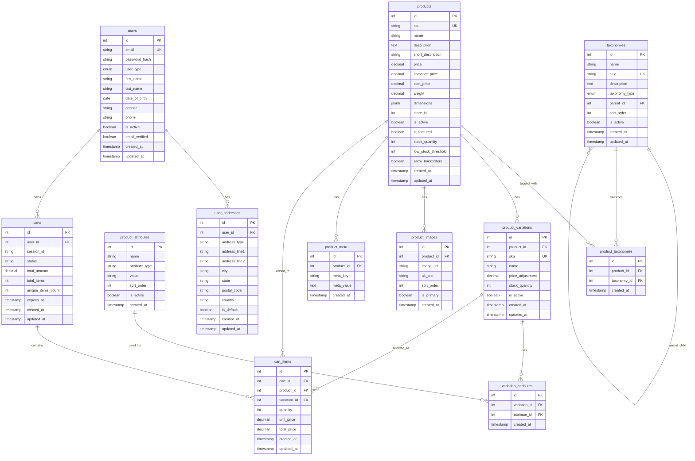

# E-commerce Database Design

## Overview
This database design focuses on the core requirements for a basic e-commerce system: customer tracking, product catalog, and shopping cart functionality.

### **Key Design Decisions**

#### **1. User Management**
- Single `users` table with `user_type` enum (`store_owner`, `customer`)
- Separate `user_addresses` table for location tracking (age, gender analysis)
- Supports both authenticated users and guest sessions
- **Customer tracking**: Age, gender, location analysis via user profiles and addresses

#### **2. Product System**
- **Products table**: Core product information with SKU, pricing, inventory
- **Product variations**: For different sizes, colors, etc.
- **Flexible attributes**: `product_attributes` table for reusable characteristics
- **Unified taxonomy system**: `taxonomies` table for categories, tags, brands, and other classifications
- **Product catalog**: SKU-based identification, multiple variations, flexible taxonomy, inventory management

#### **3. Cart System**
- **Automatic calculations**: Triggers update totals when items change
- **Session support**: Works for both logged-in and guest users
- **Real-time totals**: `total_amount`, `total_items`, `unique_items_count`
- **Shopping cart**: Add/remove items, quantity management, automatic calculations, session support

#### **4. Simplified Indexing**
- Only essential indexes for core operations
- Focus on authentication, product lookup, and cart operations

## Database Schema Diagram

## Technical Highlights

### **Unified Taxonomy System**
- Single table for categories, tags, brands, and other classifications
- Easy querying across different taxonomy types
- Flexible tagging system for products

### **Performance Optimized**
- Essential indexes only
- Efficient foreign key relationships
- Proper data types for each field

## Future Extensibility

The design allows for easy addition of:
- Discount/promotion systems
- Order management
- Payment processing
- Analytics and reporting
- Multi-store support
