# Social Media Platform Architecture Evolution

This document outlines the architectural evolution of our social media platform from a **rapid market entry strategy (Phase 1)** to a **scalable, hybrid cloud platform (Phase 2)**.

## Phase 1: Cloud-First Market Entry (Version 1.0)

### 🎯 **Objective: Get to Market Fast**

Phase 1 prioritizes **speed to market** and **operational simplicity** over cost optimization. The goal is to validate the product-market fit and establish a user base with minimal operational overhead.

### 🏗️ **Architecture Overview**

**Core Philosophy:** *"Leverage managed cloud services to focus on product development, not infrastructure management."*

```mermaid
graph TB
    %% Client Layer
    subgraph ClientLayer ["Client Layer"]
        iOS["iOS App<br/>Flutter"]
        Android["Android App<br/>Flutter"] 
        Web["Web App<br/>React"]
    end

    %% API Gateway & Load Balancer
    subgraph APIGateway ["API Gateway & Load Balancer"]
        ALB["AWS Application<br/>Load Balancer"]
        APIGW["AWS API Gateway<br/>+ CloudFront CDN"]
    end

    %% Microservices - AWS ECS/Fargate
    subgraph Microservices ["Microservices - AWS ECS/Fargate"]
        USER_SVC["User Service<br/>Golang<br/>- User Management<br/>- Profile CRUD<br/>- Authentication"]
        
        CONTENT_SVC["Content Service<br/>Golang<br/>- Content CRUD<br/>- Media Management<br/>- Content Moderation"]
        
        FEED_SVC["Feed Service<br/>Golang<br/>- Feed Generation<br/>- Content Discovery<br/>- Algorithm Logic"]
        
        INTERACTION_SVC["Interaction Service<br/>Golang<br/>- Likes/Comments<br/>- Social Features<br/>- Engagement Tracking"]
        
        CHAT_SVC["Chat Service<br/>Golang<br/>- Real-time Messaging<br/>- WebSocket Management<br/>- Message History"]
        
        NOTIFICATION_SVC["Notification Service<br/>Golang<br/>- Push Notifications<br/>- Email Notifications<br/>- Notification Preferences"]
        
        ANALYTICS_SVC["Analytics Service<br/>Golang<br/>- View Tracking<br/>- Engagement Metrics<br/>- Custom Analytics"]
    end

    %% Secure Tunneling
    subgraph SecureTunneling ["Secure Tunneling to External Services"]
        PRIVATELINK["AWS PrivateLink<br/>VPC Endpoint"]
    end

    %% Cache Layer
    subgraph CacheLayer ["Cache Layer - AWS ElastiCache"]
        REDIS[("Redis ElastiCache<br/>- Session Storage<br/>- Feed Cache<br/>- Real-time Data<br/>- Rate Limiting")]
    end

    %% Storage & Media Processing
    subgraph MediaStorage ["Media & Storage"]
        S3["AWS S3<br/>- Original uploads<br/>- Processed media<br/>- Static assets<br/>- CDN Origin"]
        
        LAMBDA["AWS Lambda<br/>Media Processing<br/>- Image resize<br/>- Video transcode<br/>- Thumbnail generation<br/>- Format conversion"]
        
        REKOGNITION["AWS Rekognition<br/>Content Moderation<br/>Auto-tagging<br/>- NSFW Detection<br/>- Object Recognition"]
    end

    %% AWS Native Services
    subgraph AWSServices ["AWS Native Services"]
        COGNITO["AWS Cognito<br/>Authentication<br/>- User Pools<br/>- Identity Pools<br/>- Social Login<br/>- MFA Support"]
        
        SES["AWS SES<br/>Email Service<br/>- Transactional Emails<br/>- Marketing Emails<br/>- Bounce Handling"]
        
        SNS["AWS SNS<br/>Push Notifications<br/>- Mobile Push<br/>- Topic Management<br/>- Delivery Tracking"]
        
        EVENTBRIDGE["AWS EventBridge<br/>Event Bus<br/>- Service Communication<br/>- Event Routing<br/>- Decoupled Architecture"]
    end

    %% Monitoring & Observability
    subgraph Monitoring ["Monitoring & Observability"]
        CLOUDWATCH["AWS CloudWatch<br/>- Metrics<br/>- Logs<br/>- Alarms<br/>- Dashboards"]
        
        XRAY["AWS X-Ray<br/>Distributed Tracing<br/>- Service Maps<br/>- Performance Analysis<br/>- Error Tracking"]
        
        REPORT_LAMBDA["Lambda Function<br/>Daily Reports<br/>- Analytics Reports<br/>- Email via SES<br/>- Custom Dashboards"]
    end

    %% CI/CD Pipeline - Simple
    subgraph CICD ["CI/CD Pipeline - Simple"]
        GITHUB["GitHub<br/>Source Code<br/>- Main/Feature Branches"]
        CODEBUILD["AWS CodeBuild<br/>Build & Test<br/>- Docker Build<br/>- Unit Tests<br/>- Push to ECR"]
        ECR["AWS ECR<br/>Container Registry<br/>- Service Images<br/>- Latest Tags"]
        ECS_DEPLOY["ECS Deployment<br/>- Rolling Updates<br/>- Health Checks"]
    end

    %% External Services
    subgraph ExternalServices ["External Services"]
        OMISE["Omise<br/>Payment Processing<br/>(Future premium features)"]
        
        subgraph MONGO_ATLAS ["MongoDB Atlas - Managed Document DB"]
            USER_DB[("User DB<br/>MongoDB<br/>- Users<br/>- Profiles<br/>- Preferences")]
            
            CONTENT_DB[("Content DB<br/>MongoDB<br/>- Posts<br/>- Media Metadata<br/>- Content Tags")]
            
            FEED_DB[("Feed DB<br/>MongoDB<br/>- Feed Items<br/>- User Feeds<br/>- Algorithm Data")]
            
            INTERACTION_DB[("Interaction DB<br/>MongoDB<br/>- Likes<br/>- Comments<br/>- Shares")]
            
            CHAT_DB[("Chat DB<br/>MongoDB<br/>- Messages<br/>- Conversations<br/>- Chat Metadata")]
            
            ANALYTICS_DB[("Analytics DB<br/>MongoDB<br/>- View Events<br/>- Engagement Data<br/>- Metrics")]
        end
    end

    %% Client Connections
    iOS --> ALB
    Android --> ALB
    Web --> ALB
    
    %% API Gateway Connections
    ALB --> APIGW
    APIGW --> USER_SVC
    APIGW --> CONTENT_SVC
    APIGW --> FEED_SVC
    APIGW --> INTERACTION_SVC
    APIGW --> CHAT_SVC
    APIGW --> NOTIFICATION_SVC
    APIGW --> ANALYTICS_SVC
    
    %% Service to Database Connections via PrivateLink
    USER_SVC --> PRIVATELINK
    CONTENT_SVC --> PRIVATELINK
    FEED_SVC --> PRIVATELINK
    INTERACTION_SVC --> PRIVATELINK
    CHAT_SVC --> PRIVATELINK
    ANALYTICS_SVC --> PRIVATELINK
    
    %% PrivateLink to specific MongoDB databases
    PRIVATELINK --> USER_DB
    PRIVATELINK --> CONTENT_DB
    PRIVATELINK --> FEED_DB
    PRIVATELINK --> INTERACTION_DB
    PRIVATELINK --> CHAT_DB
    PRIVATELINK --> ANALYTICS_DB
    
    %% Service to Cache Connections
    USER_SVC --> REDIS
    FEED_SVC --> REDIS
    CHAT_SVC --> REDIS
    INTERACTION_SVC --> REDIS
    
    %% Service to AWS Native Services
    USER_SVC --> COGNITO
    NOTIFICATION_SVC --> SES
    NOTIFICATION_SVC --> SNS
    CONTENT_SVC --> S3
    CONTENT_SVC --> REKOGNITION
    
    %% Media Processing Pipeline
    S3 --> LAMBDA
    LAMBDA --> S3
    LAMBDA --> REKOGNITION
    
    %% Event-Driven Communication
    USER_SVC --> EVENTBRIDGE
    CONTENT_SVC --> EVENTBRIDGE
    INTERACTION_SVC --> EVENTBRIDGE
    FEED_SVC --> EVENTBRIDGE
    NOTIFICATION_SVC --> EVENTBRIDGE
    ANALYTICS_SVC --> EVENTBRIDGE
    
    %% Monitoring Connections
    USER_SVC --> CLOUDWATCH
    CONTENT_SVC --> CLOUDWATCH
    FEED_SVC --> CLOUDWATCH
    INTERACTION_SVC --> CLOUDWATCH
    CHAT_SVC --> CLOUDWATCH
    NOTIFICATION_SVC --> CLOUDWATCH
    ANALYTICS_SVC --> CLOUDWATCH
    
    %% Tracing
    USER_SVC --> XRAY
    CONTENT_SVC --> XRAY
    FEED_SVC --> XRAY
    INTERACTION_SVC --> XRAY
    CHAT_SVC --> XRAY
    NOTIFICATION_SVC --> XRAY
    ANALYTICS_SVC --> XRAY
    
    %% Analytics Reporting
    ANALYTICS_SVC --> REPORT_LAMBDA
    REPORT_LAMBDA --> SES
    
    %% CI/CD Pipeline Connections
    GITHUB --> CODEBUILD
    CODEBUILD --> ECR
    ECR --> ECS_DEPLOY
    ECS_DEPLOY --> USER_SVC
    ECS_DEPLOY --> CONTENT_SVC
    ECS_DEPLOY --> FEED_SVC
    ECS_DEPLOY --> INTERACTION_SVC
    ECS_DEPLOY --> CHAT_SVC
    ECS_DEPLOY --> NOTIFICATION_SVC
    ECS_DEPLOY --> ANALYTICS_SVC
    
    %% Styling
    classDef clientStyle fill:#e1f5fe,stroke:#01579b,stroke-width:2px
    classDef serviceStyle fill:#f3e5f5,stroke:#4a148c,stroke-width:2px
    classDef dbStyle fill:#e8f5e9,stroke:#1b5e20,stroke-width:2px
    classDef cacheStyle fill:#fff8e1,stroke:#f57f17,stroke-width:2px
    classDef storageStyle fill:#fff3e0,stroke:#e65100,stroke-width:2px
    classDef awsStyle fill:#e3f2fd,stroke:#0277bd,stroke-width:2px
    classDef monitoringStyle fill:#f1f8e9,stroke:#33691e,stroke-width:2px
    classDef externalStyle fill:#efebe9,stroke:#3e2723,stroke-width:2px
    classDef cicdStyle fill:#fce4ec,stroke:#c2185b,stroke-width:2px
    
    class iOS,Android,Web clientStyle
    class ALB,APIGW,USER_SVC,CONTENT_SVC,FEED_SVC,INTERACTION_SVC,CHAT_SVC,NOTIFICATION_SVC,ANALYTICS_SVC serviceStyle
    class USER_DB,CONTENT_DB,FEED_DB,INTERACTION_DB,CHAT_DB,ANALYTICS_DB dbStyle
    class REDIS cacheStyle
    class S3,LAMBDA,REKOGNITION storageStyle
    class COGNITO,SES,SNS,EVENTBRIDGE,PRIVATELINK awsStyle
    class CLOUDWATCH,XRAY,REPORT_LAMBDA monitoringStyle
    class OMISE externalStyle
    class GITHUB,CODEBUILD,ECR,ECS_DEPLOY cicdStyle
```



#### **Client Layer**
- **iOS/Android Apps**: Built with Flutter for cross-platform efficiency
- **Web Application**: React-based progressive web app
- **Unified Experience**: Consistent UI/UX across all platforms

#### **API Gateway & Load Balancing**
- **AWS Application Load Balancer (ALB)**: Distributes traffic across microservices
- **AWS API Gateway + CloudFront CDN**: 
  - Global content delivery
  - API rate limiting and caching
  - Built-in DDoS protection

#### **Microservices Architecture (Kubernetes)**
Core business logic services built in **Golang** for performance:

- **User Service**: User management, profiles, authentication
- **Content Service**: Post creation, media management, content moderation
- **Feed Service**: Personalized feed generation and content discovery
- **Interaction Service**: Likes, comments, shares, social features
- **Chat Service**: Real-time messaging with WebSocket support
- **Notification Service**: Push notifications and email delivery
- **Media Processing Service**: Image/video transcoding and optimization

#### **Advanced Analytics & ML Platform**
Specialized analytics and machine learning services:

- **Real-time Analytics Service** (Golang): Live engagement tracking, stream processing, instant metrics
- **Batch Analytics Service** (Golang): Cohort analysis, retention metrics, performance reports
- **A/B Testing Service** (Golang): Feature flags, experiment management, statistical analysis
- **ML Pipeline Service** (Python): Recommendation algorithms, content moderation, trend prediction
- **ML Model Serving** (Python): Real-time predictions, model inference, A/B model testing

#### **Database Strategy: Self-Hosted MongoDB + Specialized Data Stores**
- **Self-Hosted MongoDB Cluster**: Complete control and cost optimization
- **Database Per Service**: Each microservice owns its data
  - User DB, Content DB, Feed DB, Interaction DB, Chat DB, Analytics DB, A/B Test DB
- **Specialized Data Stores**:
  - **Feature Store**: Redis + MongoDB for ML features and model artifacts
  - **Redis Cluster**: Cache, sessions, and real-time metrics
  - **Elasticsearch**: Content search and analytics indexing
  - **Apache Kafka**: Event streaming and message bus
- **Advanced Features**: Custom optimization, backup strategies, compliance control

#### **Supporting Infrastructure**
- **Cache**: AWS ElastiCache (Redis) for session storage and feed caching
- **Storage**: AWS S3 for media files and static assets
- **Media Processing**: AWS Lambda for image resizing and video transcoding
- **Content Moderation**: AWS Rekognition for automated content analysis
- **Authentication**: AWS Cognito for user pools and social login
- **Communications**: AWS SES (email) and SNS (push notifications)
- **Event Bus**: AWS EventBridge for decoupled service communication

#### **Observability & Monitoring**
- **AWS CloudWatch**: Centralized logging, metrics, and alerting
- **AWS X-Ray**: Distributed tracing for performance optimization
- **Custom Analytics**: Lambda functions for daily reporting

#### **CI/CD Pipeline**
Simple, AWS-native deployment pipeline:
- **GitHub**: Source code management
- **AWS CodeBuild**: Automated build and testing
- **AWS ECR**: Container image registry
- **ECS**: Automated rolling deployments

### ✅ **Phase 1 Benefits**
- **Fast Time-to-Market**: Launch in weeks, not months
- **Zero Infrastructure Management**: Focus 100% on product features
- **Automatic Scaling**: Managed services handle traffic growth
- **Built-in Security**: AWS security best practices included
- **Predictable Costs**: Pay-as-you-grow pricing model

### 📊 **Success Metrics for Phase 1**
- Launch within 8-12 weeks
- Handle 10K-100K active users
- 99.9% uptime with managed services
- Validate core product features and user engagement

---

## Phase 2: Scalable Hybrid Cloud Platform

### 🎯 **Objective: Scale + Control + Cost Optimization**

Once product-market fit is established, Phase 2 focuses on **massive scalability**, **operational control**, **advanced analytics**, and **cost optimization** through a hybrid cloud approach.

### 🏗️ **Architecture Evolution**

**Core Philosophy:** *"Self-host high-volume services for cost efficiency while keeping specialized services managed."*

```mermaid
graph TD
    %% Client Layer
    subgraph ClientLayer ["Client Layer"]
        iOS["iOS App<br/>Flutter"]
        Android["Android App<br/>Flutter"] 
        Web["Web App<br/>React"]
    end

    %% Edge & Gateway Layer
    subgraph EdgeGatewayLayer ["Edge & Gateway Layer"]
        direction TB
        CDN["CDN<br/>(e.g., Cloudflare)"]
        WAF["WAF<br/>(e.g., ModSecurity)"]
        LB["Load Balancer<br/>(e.g., NGINX Ingress)"]
        APIGW["API Gateway<br/>(e.g., Kong)"]
    end

    %% Application Platform - Kubernetes
    subgraph KubernetesCluster ["Application Platform - Kubernetes"]
        
        subgraph Microservices ["Business Logic Microservices"]
            direction LR
            USER_SVC["User Service<br/>Golang<br/>- User Management<br/>- Profile CRUD"]
            CONTENT_SVC["Content Service<br/>Golang<br/>- Content CRUD<br/>- Media Management"]
            FEED_SVC["Feed Service<br/>Golang<br/>- Feed Generation<br/>- Content Discovery"]
            INTERACTION_SVC["Interaction Service<br/>Golang<br/>- Likes/Comments<br/>- Engagement"]
            CHAT_SVC["Chat Service<br/>Golang<br/>- Real-time Messaging<br/>- WebSockets"]
            NOTIFICATION_SVC["Notification Service<br/>Golang<br/>- Push/Email Logic"]
            MEDIA_PROC_SVC["Media Processing Svc<br/>- Image/Video<br/>- Transcoding"]
        end

        subgraph AdvancedAnalytics ["Advanced Analytics & ML Platform"]
            direction LR
            REALTIME_ANALYTICS["Real-time Analytics<br/>Golang<br/>- Live engagement tracking<br/>- Stream processing<br/>- Instant metrics"]
            
            BATCH_ANALYTICS["Batch Analytics<br/>Golang<br/>- Cohort analysis<br/>- Retention metrics<br/>- Performance reports"]
            
            AB_TEST_SVC["A/B Testing Service<br/>Golang<br/>- Feature flags<br/>- Experiment management<br/>- Statistical analysis"]
            
            ML_PIPELINE["ML Pipeline Service<br/>Python<br/>- Recommendation engine<br/>- Content moderation<br/>- Trend prediction"]
            
            ML_SERVING["ML Model Serving<br/>Python<br/>- Real-time predictions<br/>- Model inference<br/>- A/B model testing"]
        end

        subgraph DataStores ["Data Persistence Layer"]
            direction LR
            
            subgraph MONGODB_CLUSTER ["MongoDB Cluster (Self-Hosted)"]
                USER_DB[("User DB<br/>MongoDB<br/>- Users<br/>- Profiles<br/>- Preferences")]
                
                CONTENT_DB[("Content DB<br/>MongoDB<br/>- Posts<br/>- Media Metadata<br/>- Content Tags")]
                
                FEED_DB[("Feed DB<br/>MongoDB<br/>- Feed Items<br/>- User Feeds<br/>- Algorithm Data")]
                
                INTERACTION_DB[("Interaction DB<br/>MongoDB<br/>- Likes<br/>- Comments<br/>- Shares")]
                
                CHAT_DB[("Chat DB<br/>MongoDB<br/>- Messages<br/>- Conversations<br/>- Chat Metadata")]
                
                ANALYTICS_DB[("Analytics DB<br/>MongoDB<br/>- Raw events<br/>- Processed metrics<br/>- User behavior")]
                
                EXPERIMENTS_DB[("A/B Test DB<br/>MongoDB<br/>- Experiments<br/>- Feature flags<br/>- Test results")]
            end
            
            REDIS_CLUSTER[("Redis Cluster<br/>Cache & Sessions<br/>& Real-time metrics")]
            MINIO[("MinIO Cluster<br/>S3-Compatible<br/>Object Storage")]
            KAFKA[("Apache Kafka<br/>Event Streaming<br/>& Message Bus")]
            ELASTICSEARCH[("Elasticsearch<br/>Content Search<br/>& Analytics Index")]
            
            ML_FEATURE_STORE[("Feature Store<br/>Redis + MongoDB<br/>- ML features<br/>- Model artifacts<br/>- Training data")]
        end

        subgraph PlatformServices ["Platform & Supporting Services"]
            direction LR
            KEYCLOAK["Keycloak<br/>Authentication &<br/>Identity Management"]
            VAULT["HashiCorp Vault<br/>Secrets Management"]
        end

    end

    %% Observability & Analytics Dashboards
    subgraph Observability ["Observability & Analytics Dashboards"]
        PROMETHEUS["Prometheus<br/>Metrics & Alerting"]
        GRAFANA["Grafana<br/>System Dashboards<br/>& Real-time Analytics"]
        LOKI["Loki<br/>Log Aggregation"]
        JAEGER["Jaeger<br/>Distributed Tracing"]
        
        BI_DASHBOARD["Business Intelligence<br/>Custom Dashboard<br/>- User behavior analytics<br/>- Content performance<br/>- A/B test results"]
        
        ML_DASHBOARD["ML Monitoring<br/>MLflow Dashboard<br/>- Model performance<br/>- Data drift detection<br/>- Prediction accuracy"]
        
        GRAFANA --> PROMETHEUS
        GRAFANA --> LOKI
        GRAFANA --> JAEGER
    end

    %% CI/CD & GitOps
    subgraph CICD ["CI/CD & Infrastructure"]
        GITLAB["GitLab<br/>Source Code Mgmt<br/>Container Registry"]
        JENKINS["Jenkins<br/>CI/CD Automation<br/>Build & Test"]
        SONARQUBE["SonarQube<br/>Static Code Analysis"]
        ARGOCD["ArgoCD<br/>GitOps Continuous<br/>Delivery"]
        TERRAFORM["Terraform<br/>Infrastructure as Code"]
    end

    %% External Services
    subgraph ExternalServices ["External & Third-Party Services"]
        OMISE["Omise<br/>Payment Processing"]
        
        subgraph AWSServices ["AWS Managed Services"]
            SES["AWS SES<br/>Email Service<br/>- Transactional Emails"]
            SNS["AWS SNS<br/>Push Notifications<br/>- Unified iOS/Android<br/>- Connects to APNS/FCM"]
        end
    end

    %% CONNECTIONS

    %% Client -> Edge
    iOS --> LB
    Android --> LB
    Web --> CDN
    CDN --> LB
    LB --> WAF
    WAF --> APIGW

    %% Edge -> Microservices on Kubernetes
    APIGW --> USER_SVC
    APIGW --> CONTENT_SVC
    APIGW --> FEED_SVC
    APIGW --> INTERACTION_SVC
    APIGW --> CHAT_SVC
    APIGW --> AB_TEST_SVC
    
    %% Service -> Data Stores
    USER_SVC --> USER_DB
    USER_SVC --> REDIS_CLUSTER
    CONTENT_SVC --> CONTENT_DB
    CONTENT_SVC --> ELASTICSEARCH
    FEED_SVC --> FEED_DB
    FEED_SVC --> REDIS_CLUSTER
    FEED_SVC --> ML_SERVING
    INTERACTION_SVC --> INTERACTION_DB
    CHAT_SVC --> CHAT_DB
    CHAT_SVC --> REDIS_CLUSTER
    
    %% Advanced Analytics Connections
    REALTIME_ANALYTICS --> ANALYTICS_DB
    REALTIME_ANALYTICS --> ELASTICSEARCH
    REALTIME_ANALYTICS --> REDIS_CLUSTER
    BATCH_ANALYTICS --> ANALYTICS_DB
    AB_TEST_SVC --> EXPERIMENTS_DB
    AB_TEST_SVC --> REDIS_CLUSTER
    ML_PIPELINE --> ML_FEATURE_STORE
    ML_PIPELINE --> ANALYTICS_DB
    ML_SERVING --> ML_FEATURE_STORE
    ML_SERVING --> REDIS_CLUSTER
    
    %% Media Processing Flow
    CONTENT_SVC --> MEDIA_PROC_SVC
    CONTENT_SVC --> MINIO
    MEDIA_PROC_SVC --> MINIO
    
    %% Service -> Platform Services
    USER_SVC --> KEYCLOAK
    Microservices -- "reads secrets from" --> VAULT
    AdvancedAnalytics -- "reads secrets from" --> VAULT

    %% Event-Driven Connections
    USER_SVC -- "publishes/subscribes" --> KAFKA
    CONTENT_SVC -- "publishes/subscribes" --> KAFKA
    INTERACTION_SVC -- "publishes/subscribes" --> KAFKA
    FEED_SVC -- "subscribes" --> KAFKA
    NOTIFICATION_SVC -- "subscribes" --> KAFKA
    ELASTICSEARCH -- "consumes" --> KAFKA
    REALTIME_ANALYTICS -- "consumes" --> KAFKA
    BATCH_ANALYTICS -- "consumes" --> KAFKA
    ML_PIPELINE -- "consumes" --> KAFKA
    
    %% Notification Flow
    NOTIFICATION_SVC --> SES
    NOTIFICATION_SVC --> SNS

    %% Dashboard Connections
    ELASTICSEARCH --> GRAFANA
    ANALYTICS_DB --> BI_DASHBOARD
    EXPERIMENTS_DB --> BI_DASHBOARD
    ML_FEATURE_STORE --> ML_DASHBOARD
    REALTIME_ANALYTICS --> GRAFANA

    %% Observability Connections
    KubernetesCluster -- "metrics" --> PROMETHEUS
    KubernetesCluster -- "logs" --> LOKI
    KubernetesCluster -- "traces" --> JAEGER
    
    %% CI/CD Flow
    GITLAB -- "triggers build" --> JENKINS
    JENKINS -- "runs analysis" --> SONARQUBE
    JENKINS -- "pushes image to" --> GITLAB
    GITLAB -- "webhook" --> ARGOCD
    ARGOCD -- "pulls manifest from" --> GITLAB
    ARGOCD -- "deploys & manages" --> KubernetesCluster
    TERRAFORM -- "provisions" --> KubernetesCluster

    %% External Connections
    APIGW --> OMISE

    %% Styling
    classDef clientStyle fill:#e1f5fe,stroke:#01579b,stroke-width:2px
    classDef edgeStyle fill:#e0f7fa,stroke:#006064,stroke-width:2px
    classDef k8sStyle fill:#e3f2fd,stroke:#0d47a1,stroke-width:2px
    classDef microserviceStyle fill:#f3e5f5,stroke:#4a148c,stroke-width:2px
    classDef analyticsStyle fill:#fff3e0,stroke:#ef6c00,stroke-width:2px
    classDef dataStyle fill:#e8f5e9,stroke:#1b5e20,stroke-width:2px
    classDef platformSvcStyle fill:#f1f8e9,stroke:#33691e,stroke-width:2px
    classDef cicdStyle fill:#fce4ec,stroke:#880e4f,stroke-width:2px
    classDef obsStyle fill:#fff8e1,stroke:#f57f17,stroke-width:2px
    classDef externalStyle fill:#efebe9,stroke:#3e2723,stroke-width:2px

    class iOS,Android,Web clientStyle
    class CDN,WAF,LB,APIGW edgeStyle
    class KubernetesCluster k8sStyle
    class USER_SVC,CONTENT_SVC,FEED_SVC,INTERACTION_SVC,CHAT_SVC,NOTIFICATION_SVC,MEDIA_PROC_SVC microserviceStyle
    class REALTIME_ANALYTICS,BATCH_ANALYTICS,AB_TEST_SVC,ML_PIPELINE,ML_SERVING analyticsStyle
    class USER_DB,CONTENT_DB,FEED_DB,INTERACTION_DB,CHAT_DB,ANALYTICS_DB,EXPERIMENTS_DB,REDIS_CLUSTER,MINIO,KAFKA,ELASTICSEARCH,ML_FEATURE_STORE dataStyle
    class KEYCLOAK,VAULT platformSvcStyle
    class GITLAB,JENKINS,SONARQUBE,ARGOCD,TERRAFORM cicdStyle
    class PROMETHEUS,GRAFANA,LOKI,JAEGER,BI_DASHBOARD,ML_DASHBOARD obsStyle
    class OMISE,SES,SNS externalStyle
```



### 🔄 **Key Architectural Changes**

#### **1. Container Orchestration: AWS → Kubernetes**
**Migration from AWS ECS/Fargate to Kubernetes**
- **Benefit**: Cloud-agnostic platform, better resource utilization
- **Enhanced DevOps**: GitOps workflows with ArgoCD
- **Cost Savings**: More efficient resource allocation

#### **2. Database Strategy: Managed → Self-Hosted**
**MongoDB Atlas → Self-Hosted MongoDB Cluster on Kubernetes**
- **Cost Reduction**: 60-70% savings on database costs at scale
- **Full Control**: Custom optimization, backup strategies, compliance
- **Same Data Model**: Smooth migration path from Phase 1

#### **3. Storage Strategy: AWS S3 → MinIO**
**Self-hosted, S3-compatible object storage**
- **Zero Migration Effort**: Same S3 API, just change endpoint
- **Massive Cost Savings**: No egress fees, storage costs reduced by 70%
- **Data Sovereignty**: Complete control over data location and access

#### **4. Advanced Observability & Analytics Dashboards**
**CloudWatch → Prometheus + Grafana + Loki + Jaeger + Specialized Dashboards**
- **Prometheus**: Advanced metrics collection and alerting
- **Grafana**: System dashboards and real-time analytics visualization
- **Loki**: Efficient log aggregation and search
- **Jaeger**: Distributed tracing for complex microservices
- **Business Intelligence Dashboard**: User behavior analytics, content performance, A/B test results
- **ML Monitoring Dashboard**: Model performance tracking, data drift detection, prediction accuracy

#### **5. Enhanced CI/CD & GitOps**
**AWS CodePipeline → GitLab + Jenkins + ArgoCD**
- **GitLab**: Source code management and container registry
- **Jenkins**: Powerful, extensible build automation
- **SonarQube**: Static code analysis and quality gates
- **ArgoCD**: GitOps continuous delivery with rollback capabilities
- **Terraform**: Infrastructure as Code for reproducible deployments

#### **6. Event-Driven Architecture: EventBridge → Kafka**
**Advanced data streaming and analytics**
- **Apache Kafka**: High-throughput event streaming
- **Real-time Analytics**: Stream processing for instant insights
- **Data Pipeline**: Foundation for machine learning and AI features

#### **7. Enhanced Security & Identity**
- **Keycloak**: Open-source identity and access management
- **HashiCorp Vault**: Centralized secrets management
- **WAF (ModSecurity)**: Web application firewall for threat protection ex bot protection, DDos attack fileupload protection and etc

### 🔧 **Hybrid Cloud Strategy**

#### **Self-Hosted Components (Cost & Control)**
- **Compute**: Kubernetes cluster for all microservices
- **Databases**: MongoDB, Redis, Elasticsearch clusters
- **Storage**: MinIO for object storage
- **Message Queuing**: Apache Kafka
- **Observability**: Prometheus, Grafana, Loki, Jaeger

#### **Managed Services (Convenience & Reliability)**
- **Email**: AWS SES ($0.10/1000 emails - extremely cost-effective)
- **Push Notifications**: AWS SNS ($0.50/million notifications)
- **Payments**: Omise for payment processing
- **Edge Security**: WAF and CDN services

### 📈 **Advanced Analytics Capabilities**

#### **Real-Time Data Pipeline**
```
User Actions → Kafka → Stream Processing → Analytics DB
                  ↓
            Real-time Dashboards
```

#### **Enhanced Analytics Features**

**Real-time Engagement Metrics** (Real-time Analytics Service)
- Live user activity tracking and instant engagement metrics
- Stream processing of user interactions via Kafka
- Sub-second latency for trending content detection

**Content Performance Analytics** (Batch Analytics Service + Elasticsearch)
- Post reach analysis, engagement rates, and viral content identification
- Complex aggregation queries and content indexing
- Performance dashboards and automated reporting

**User Behavior Analysis** (Batch Analytics Service)
- Funnel analysis for user journey optimization
- Cohort analysis and retention metrics
- Behavioral segmentation and pattern recognition

**A/B Testing Framework** (A/B Testing Service)
- Feature flags for controlled rollouts
- Statistical experiment management and analysis
- Real-time experiment monitoring and automated decision making

**Machine Learning Pipeline** (ML Pipeline + ML Serving Services)
- Recommendation algorithms for personalized feeds
- Automated content moderation using AI models
- Trend prediction and user preference learning
- Real-time model inference and A/B model testing

### 💰 **Cost Optimization Results**

| Component | Phase 1 (Managed) | Phase 2 (Hybrid) | Savings |
|-----------|-------------------|-------------------|---------|
| **Database** | MongoDB Atlas | Self-hosted MongoDB | 60-70% |
| **Storage** | AWS S3 | MinIO | 70-80% |
| **Compute** | ECS/Fargate | Kubernetes | 40-50% |
| **Monitoring** | CloudWatch | Prometheus Stack | 80% |
| **Message Queue** | EventBridge | Kafka | 90% |
| **Overall Platform** | $100K/month | $40K/month | **60%** |

*Note: Savings increase significantly with scale*

### ⚡ **Performance & Scalability Improvements**

- **Database Performance**: MongoDB optimized for specific workloads
- **Storage Performance**: MinIO co-located with compute (no network latency)
- **Event Processing**: Kafka handles millions of events per second
- **Caching**: Distributed Redis cluster for sub-millisecond response times
- **Search**: Elasticsearch for complex queries and full-text search

### 🛡️ **Enhanced Security & Compliance**

- **Data Sovereignty**: All data processing within controlled infrastructure
- **Secrets Management**: Centralized with HashiCorp Vault
- **Identity Management**: Keycloak with RBAC and SSO
- **Network Security**: WAF protection and network policies
- **Audit Logging**: Comprehensive audit trails for compliance

### 🔄 **Migration Strategy: Phase 1 → Phase 2**

#### **1. Infrastructure Preparation**
- Deploy Kubernetes cluster
- Set up CI/CD pipeline (GitLab, Jenkins, ArgoCD)
- Deploy observability stack

#### **2. Database Migration**
- Deploy MongoDB on Kubernetes
- Dual-write approach (Atlas + self-hosted)
- Data synchronization and validation
- Traffic cutover with rollback capability

#### **3. Storage Migration**
- Deploy MinIO cluster
- Background data migration from S3
- Application endpoint configuration
- Performance testing and validation

#### **4. Service Migration**
- Microservices containerization updates
- Rolling deployment to Kubernetes
- Load balancer reconfiguration
- Monitoring and alerting setup

#### **5. Decommissioning**
- Phase out AWS managed services
- Cost optimization verification
- Documentation and knowledge transfer

---

## 🎯 **Summary: Why This Evolution Makes Sense**

### **Phase 1: Speed to Market**
- ✅ Launch quickly with proven, managed services
- ✅ Validate product-market fit
- ✅ Focus on features, not infrastructure
- ✅ Predictable costs during growth phase

### **Phase 2: Scale and Optimize**
- ✅ Massive cost reduction (60%+ savings)
- ✅ Enhanced performance and control
- ✅ Advanced analytics and AI capabilities
- ✅ Platform independence and flexibility
- ✅ Enterprise-grade security and compliance

This two-phase approach allows us to **move fast initially** while building toward a **highly scalable, cost-effective platform** that can compete with industry giants.